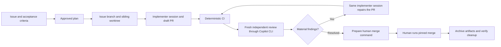

# Agentic GitHub workflow template

Turn a scoped issue into an isolated implementation, an independently reviewed PR,
and a deliberate human merge. Use this repository to start a new project or add the
workflow to an existing one.

The implementation follows the complete [33-page operating guide](Issue-to-PR-Development-with-Worktree-Isolation.pdf)
and its [TeX source](Issue-to-PR-Development-with-Worktree-Isolation.tex), with documented
corrections for safe cleanup, review isolation, and commit identity.



**Model policy:** two switchable profiles, declared in `.agentic/config.json`:

| Profile | Implementer (draft, plan, implement, repair) | Independent reviewer (Copilot CLI) | Default |
| --- | --- | --- | --- |
| `astra-claude` | Codex CLI, `gpt-6-astra`, ChatGPT account | `claude-opus-5` | yes |
| `fable-gpt` | Claude Code, `claude-fable-5-1`, Claude subscription | `gpt-6-astra` | no |

`python3 scripts/agentic/workflow.py profile use fable-gpt` switches this checkout through
an ignored local file; `AGENTIC_PROFILE=fable-gpt` overrides one command; `profile show`
prints the resolved profile. A task keeps the profile recorded at its first managed launch.
Both reviewers keep the 400-AI-credit limit and 15-minute timeout per review. One attempted
round is the default; further review needs a supported critical P0/P1 finding or an explicit
user request. There is no automatic model fallback. Verify account entitlement per profile
with the [Opus](docs/agent-workflow/REVIEW.md#claude-opus-5-access) and
[GPT-6 Astra](docs/agent-workflow/REVIEW.md#gpt-6-astra-access) access guidance.

## Start here

| Your task | Read / run |
| --- | --- |
| Set up a new project or publish this template | [Setup and GitHub configuration](docs/agent-workflow/SETUP.md) |
| Add the workflow to an existing project | [Safe installation procedure](docs/agent-workflow/SETUP.md#existing-projects) |
| Invoke the complete workflow or one phase | [Eight workflow skills](docs/agent-workflow/SKILLS.md) |
| Work an issue from start to finish | [Operating guide](docs/agent-workflow/OPERATING-GUIDE.md) |
| Merge a reviewed PR and preserve its artifacts | [Human finishing procedure](docs/agent-workflow/FINISH.md) |
| Run local or manual Actions review | [Independent review](docs/agent-workflow/REVIEW.md) |
| Adopt in NICME | [Migration plan](docs/adoption/NICME.md) · [validation design](docs/adoption/NICME-VALIDATION.md) |
| Adopt in SpiderML | [SpiderML adoption](docs/adoption/SpiderML.md) |
| Understand changes from the PDF | [Requirement traceability](docs/agent-workflow/TRACEABILITY.md) |
| Assess what has actually been verified | [Verification record](docs/agent-workflow/VERIFICATION.md) |
| Check sources and tool versions | [Research and decisions](docs/agent-workflow/RESEARCH.md) |

```bash
python3 -m venv .venv
.venv/bin/python -m pip install -r requirements-dev.txt
# Install Node.js 24 LTS for the opt-in example's repository checks.
make check
python3 scripts/agentic/workflow.py doctor
```

Runtime: Linux/macOS, Python 3.12+, Git, GNU Make, `gh`, `copilot`, and `codex` or `claude`
as the active profile requires. The portable
workflow test suite uses only the Python standard library and Git. CI needs no model
credentials. Windows users should use WSL; local operation locks use POSIX `flock`.

Repository development also uses Node.js 24 for the dependency-free
[AI2S skills intake example](examples/ai2s-skills-intake/README.md). Run its tests with
`make test-ai2s` (or `make test-ai2s NODE=/path/to/node`). The portable workflow
installer excludes the example and its repository-only Node.js CI setup.

## Invoke the workflow

Start Codex (`$agentic-workflow …`) or Claude Code (`/agentic-workflow …`) in a clean
control checkout and describe the task:

```text
$agentic-workflow Describe the task to implement
```

The host you type into coordinates; the active profile decides which implementer backend
the managed launcher starts. The coordinator publishes an issue and proposed plan, waits
for your plan approval, then starts the pinned implementer session in the sibling worktree.
Repairs resume that session; every independent review starts fresh. Use
`$agentic-review PR #456` or `$agentic-repair PR #456` (`/agentic-…` in Claude Code) for a
single phase. The [skill guide](docs/agent-workflow/SKILLS.md) lists all eight entrypoints
and recovery behavior. `$agentic-finish` prepares the script that you run to merge, archive
ignored artifacts, and clean up verified branches.

## What is included

- Eight repository skills (mirrored for Claude Code), approved-contract records and a
  resumable implementer session pinned per task.
- Two switchable implementer/reviewer profiles, restricted-by-default Claude containment,
  and a reviewer model frozen per review round.
- A human-run finish script with recoverable artifact archival and guarded branch cleanup.
- Required issue fields and a PR template separating software evidence from domain evidence.
- Sibling task worktrees, existing-branch recovery, draft PR creation and merge preflight.
- A fresh Copilot reviewer with read/search tools, source snapshots and SHA-bound COMMENT reviews.
- A manual, opt-in Actions review with separate generation and publication permissions.
- Deterministic CI, a ruleset generator, pinned Actions, and regression tests for unsafe states.
- An installation preview that refuses file conflicts before writing anything.
- A command runner that records validation provenance, input hashes and artifact hashes.
- Public adoption plans and a private, ignored `memory/` directory initialized locally.

This is a human-supervised workflow. It does not merge autonomously, train models
on every PR, or treat an AI review as scientific validation. A GitHub template copies
files; rulesets, secrets, environments and account access must be configured separately.

The supplied PDF and TeX remain unchanged reference documents. No license has been
selected for public redistribution of this repository; its owner should choose one
before inviting third-party reuse. Existing project licenses remain their own.
