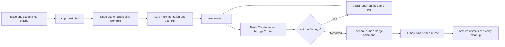

# Agentic GitHub workflow template

Turn a scoped issue into an isolated implementation, an independently reviewed PR,
and a deliberate human merge. Use this repository to start a new project or add the
workflow to an existing one.

The implementation follows the complete [33-page operating guide](Issue-to-PR-Development-with-Worktree-Isolation.pdf)
and its [TeX source](Issue-to-PR-Development-with-Worktree-Isolation.tex), with documented
corrections for safe cleanup, review isolation, and commit identity.



**Model policy:** `gpt-6-astra` for drafting, planning, implementation and repair.
The independent reviewer uses an explicit Claude model through Copilot CLI;
`claude-fable-5` is the configured reviewer. There is no automatic cheaper-model
fallback. Availability and billing belong to your provider account. Fable has
model-specific access and data-retention requirements; read the
[Fable setup guidance](docs/agent-workflow/REVIEW.md#claude-fable-5-access-and-data-handling)
before sending a project's review packet.

## Start here

| Your task | Read / run |
| --- | --- |
| Set up a new project or publish this template | [Setup and GitHub configuration](docs/agent-workflow/SETUP.md) |
| Add the workflow to an existing project | [Safe installation procedure](docs/agent-workflow/SETUP.md#existing-projects) |
| Invoke the complete workflow or one phase | [Eight workflow skills](docs/agent-workflow/SKILLS.md) |
| Work an issue from start to finish | [Operating guide](docs/agent-workflow/OPERATING-GUIDE.md) |
| Merge a reviewed PR and preserve its artifacts | [Human finishing procedure](docs/agent-workflow/FINISH.md) |
| Run local or manual Actions review | [Independent review](docs/agent-workflow/REVIEW.md) |
| Adopt in NICME | [Migration plan](docs/adoption/NICME.md) · [validation design](docs/adoption/NICME-VALIDATION.md) |
| Adopt in SpiderML | [SpiderML adoption](docs/adoption/SpiderML.md) |
| Understand changes from the PDF | [Requirement traceability](docs/agent-workflow/TRACEABILITY.md) |
| Assess what has actually been verified | [Verification record](docs/agent-workflow/VERIFICATION.md) |
| Check sources and tool versions | [Research and decisions](docs/agent-workflow/RESEARCH.md) |

```bash
python3 -m venv .venv
.venv/bin/python -m pip install -r requirements-dev.txt
make check
python3 scripts/agentic/workflow.py doctor
```

Runtime: Linux/macOS, Python 3.12+, Git, GNU Make, `gh`, `codex`, and `copilot`. The portable
workflow test suite uses only the Python standard library and Git. CI needs no model
credentials. Windows users should use WSL; local operation locks use POSIX `flock`.

## Invoke the workflow

Start Codex in this checkout and use:

```text
$agentic-workflow Describe the task to implement
```

The coordinator publishes an issue and proposed plan, waits for your plan approval,
then starts a dedicated Astra executor in the sibling worktree. Repairs resume that
executor; every Fable review starts fresh. Use `$agentic-review PR #456` or
`$agentic-repair PR #456` for a single phase. The [skill guide](docs/agent-workflow/SKILLS.md)
lists all eight entrypoints and recovery behavior. `$agentic-finish` prepares the
script that you run to merge, archive ignored artifacts, and clean up verified branches.

## What is included

- Eight repository skills, approved-contract records and a resumable Astra executor.
- A human-run finish script with recoverable artifact archival and guarded branch cleanup.
- Required issue fields and a PR template separating software evidence from domain evidence.
- Sibling task worktrees, existing-branch recovery, draft PR creation and merge preflight.
- A fresh Copilot reviewer with read/search tools, source snapshots and SHA-bound COMMENT reviews.
- A manual, opt-in Actions review with separate generation and publication permissions.
- Deterministic CI, a ruleset generator, pinned Actions, and regression tests for unsafe states.
- An installation preview that refuses file conflicts before writing anything.
- A command runner that records validation provenance, input hashes and artifact hashes.
- Public adoption plans and a private, ignored `memory/` directory initialized locally.

This is a human-supervised workflow. It does not merge autonomously, train models
on every PR, or treat an AI review as scientific validation. A GitHub template copies
files; rulesets, secrets, environments and account access must be configured separately.

The supplied PDF and TeX remain unchanged reference documents. No license has been
selected for public redistribution of this repository; its owner should choose one
before inviting third-party reuse. Existing project licenses remain their own.
