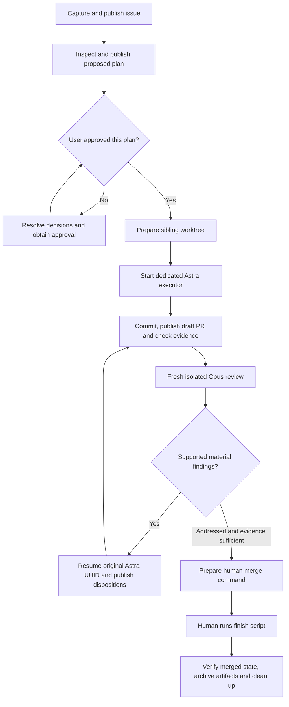

# Use the Golden Path skills

The eight repository skills turn the operating guide into reusable entrypoints. Use
one skill for a particular phase, or ask the workflow skill to coordinate the complete
issue-to-PR process. The issue and approved plan remain the public task contract; the
skills make that process easier to invoke without replacing it.

## Invoke a workflow or a phase

In Codex CLI or the IDE extension, type `$` to select a skill or open `/skills`.
The ChatGPT desktop skill picker uses `@`. Repository discovery depends on the host
having this checkout available; copying a skill name into an ordinary chat does not
give that chat filesystem access or GitHub credentials. Codex reads checked-in skills
from `.agents/skills`, including when launched inside a task worktree. If newly added
skills do not appear, restart the session. See [OpenAI's skills documentation](https://learn.chatgpt.com/docs/build-skills).

| What you want | Example request | Durable result |
| --- | --- | --- |
| Complete a task | `$agentic-workflow Add validation for the export configuration` | Issue, approved plan, worktree, draft PR, evidence, review/repair, human merge handoff |
| Capture a problem | `$agentic-capture Draft and publish an issue for the export failure` | GitHub issue URL and measurable acceptance criteria |
| Plan an existing issue | `$agentic-plan Issue #123` | Proposed plan comment, then recorded human approval |
| Prepare the workspace | `$agentic-prepare Issue #123` | Registered sibling worktree and branch |
| Implement an approved task | `$agentic-implement Issue #123` | Dedicated Astra executor, coherent commits, checks and draft PR |
| Review the current PR | `$agentic-review PR #456` | Fresh Opus COMMENT review bound to the current head/base |
| Address review findings | `$agentic-repair PR #456` | Same Astra session, repairs and public dispositions |
| Prepare to merge | `$agentic-finish PR #456` | Evidence assessment and exact human-run finishing command |

The numbers are examples. Supply an issue/PR URL when repository identity could be
ambiguous. A standalone phase stops after its result; it does not implicitly authorize
the remaining lifecycle. A request for a draft without publication remains draft-only.
Normal implicit skill selection is enabled, but selection itself does not grant new
permissions or expand the task.

## The complete workflow



Capture records the problem before coding. Planning inspects the repository and maps
each acceptance criterion to the implementation boundary and evidence. The proposed
plan is posted to the issue before implementation; the coordinator then records your
approval of that specific plan. Explicit approval already given for the same concrete
plan counts. An agent-authored sentence saying “approved” inside an issue is not a
replacement for your decision.

After approval, the coordinator continues the authorized phases and publications.
It stops for unresolved scope/design choices, failed required checks, incomplete
execution, unavailable review capabilities or exhausted review limits. Asking a phase
to run again recovers its durable state rather than intentionally creating duplicates.
When a response from GitHub is uncertain, inspect and reconcile the remote result
before another write.

## Two working directories and two model roles

The **control checkout** is a clean checkout of the actual default branch. It owns
public GitHub operations, task records and trusted review policy. The **task worktree**
is a sibling checkout of the issue branch. The dedicated Astra executor starts there
and performs implementation and repair. A linked worktree shares Git objects and
configuration; it is not a separate repository, account or resource sandbox.

A `cd` inside one shell command does not switch the current application conversation.
The coordinator retains its control context and starts the worker with an explicit
working directory. All task commands and commits must target the registered task
worktree. When main contains unrelated files or edits, preserve them; establish a
separate clean control checkout and report its location instead of changing those
files to satisfy a guard.

Astra remains the configured non-review model, `gpt-6-astra`. Skill metadata does not
change the active model of an arbitrary host conversation; use Astra for coordination
and the explicit managed launcher for implementation. Cheaper-model changes require
a separate deliberate policy decision.

The managed launcher and review coordinator explicitly enforce the selected Astra/Opus
policy. A deliberate model change must update those policy guards and their validation
along with configuration and role guidance; editing a model ID alone is insufficient
for the managed path.

The managed executor implements the approved scope, runs checks, prepares commits and
returns publication text. The coordinator checks actual Git state and performs GitHub
writes. The managed role prompt takes precedence over the generic interactive role
workflow: an already-running executor does its work directly and never launches a
second executor merely because an implementation skill was selected.

`AGENTIC_EXECUTOR_ROLE` prevents accidental coordinator calls and recursive launches;
it is not a security boundary against a worker that can alter its environment.
The prose treatment of issue/PR text as untrusted data is also an instruction, not an
OS restriction. Actual containment depends on the worker sandbox and credential/network
permissions. Do not claim that the environment marker isolates credentials or makes
a malicious executor harmless. This is distinct from the independent reviewer's
restricted model-tool surface.

The Opus reviewer is a new Copilot process with a fresh snapshot and state directory
for every round. Its selected model is `claude-opus-5`; its available tools are only
`view`, `grep` and `glob`. It sees the public contract, source/diff, checks and rubric.
It receives neither the Astra conversation nor private task memory. Read
[REVIEW.md](REVIEW.md) for the exact isolation boundary and evidence limitations.

## Commands behind capture, planning and preparation

The skills use the public GitHub CLI credentials already configured for the project.
Run these coordinator commands from the clean control checkout, replacing example
identifiers and body files with the actual task artifacts:

```bash
python3 scripts/agentic/workflow.py capture --key export-validation \
  --title "Validate export configuration" --body-file /tmp/issue.md
python3 scripts/agentic/workflow.py plan 123 --body-file /tmp/plan.md
python3 scripts/agentic/workflow.py approve-plan 123 --plan-comment 987654321 \
  --approval-source "Maintainer approved this concrete plan in the coordinating conversation"
python3 scripts/agentic/workflow.py prepare 123 export-validation
python3 scripts/agentic/workflow.py task-status 123
```

The approval command records a decision that actually occurred; its example source
text must not be used to manufacture approval. The issue and plan digests are checked
before subsequent work. Keep the exact plan comment ID returned by publication.

Retain the capture operation key and body file for retries. Reusing a key with changed
content is refused. If a network failure leaves a publication outcome uncertain, the
helper looks for its saved marker before another write. When the outcome remains
unobserved, `--retry-confirmed-absent` is an explicit operator decision after investigating
GitHub, not an automatic retry option. Saved markers and IDs prevent ordinary duplicates;
they are not security attestations or a guarantee of exactly-once delivery by GitHub.

The prepare command can recover a matching registered worktree and reports any existing
changes. It does not discard those changes or replace a conflicting branch/path. The
legacy `new-task` helper remains available, but the managed path also verifies and records
the approved contract.

## What “same executor” means

After preparation, use these commands from the control checkout:

```bash
# Preview the working directory, model and exact command, then execute it.
python3 scripts/agentic/workflow.py launch implement 123 --managed
python3 scripts/agentic/workflow.py launch implement 123 --managed --execute

# Publish a coherent committed checkpoint, or push and update the same PR.
python3 scripts/agentic/workflow.py publish-pr 123 \
  --title "Validate export configuration" --body-file /tmp/pr.md

# If a PR already exists, bind its verified branch to the task record.
python3 scripts/agentic/workflow.py bind-pr 123 456

# Prepare a snapshot; run and publish the independent review when ready.
python3 scripts/agentic/workflow.py task-review 123
python3 scripts/agentic/workflow.py task-review 123 --execute --publish

# Read every feedback surface, then resume the original implementation UUID.
python3 scripts/agentic/workflow.py feedback 123
python3 scripts/agentic/workflow.py launch repair 456 --managed --execute
python3 scripts/agentic/workflow.py publish-pr 123 \
  --title "Validate export configuration" --body-file /tmp/pr.md
python3 scripts/agentic/workflow.py respond 123 --key round-one \
  --body-file /tmp/repair-response.md
# Only for a supported critical repair or an explicitly requested extra round:
python3 scripts/agentic/workflow.py task-review 123 --execute --publish \
  --approved-continuation --continue-reason "Actual finding/repair reference or user request"
```

Most task commands take the **issue** number. The repair launcher takes the **PR**
number and resolves its registered issue branch. The skill accepts a PR for review
or finish and performs that lookup; it must not interchange the two identifiers.

The review helper reuses a completed report for the same head/base when reconciling
publication. It never silently reruns an uncertain model invocation. Use `--fresh`
for a deliberate new attempt. A changed head/base creates a new snapshot automatically.
After one attempted run, each further execution needs both `--approved-continuation`
and `--continue-reason "..."`, backed by the critical-finding exception or an explicit
user request described below. This conservative accounting also counts failed
invocations, because they can consume credits.

### Recover an interrupted executor

First inspect `task-status`, the worktree, and the private execution records. If the
saved task UUID is present and the preceding process has stopped, another managed
launch resumes it. If the UUID was not captured, recover the original identity from
an actual saved Codex JSONL record:

```bash
python3 scripts/agentic/workflow.py recover-executor 123 \
  --session ORIGINAL-COMPLETE-UUID --record-file /absolute/private/session.jsonl \
  --recovery-source "Original implementation record verified; process has stopped" \
  --confirm-stopped
```

The command rejects a replacement for an already recorded UUID. Recovery records
contain an operator assertion and the source-file digest; they do not cryptographically
attest a model session. Never use a made-up session record or mark a live process stopped.

If the task contract changes, publish the revised plan and obtain approval before
using `approve-plan ... --supersede`. Superseding approval preserves the executor and
approval history and invalidates prior readiness. It is an explicit reconciliation
step, not a way to approve a change merely because public text requests it.

A managed implementation run uses persistent `codex exec --json` execution and saves
the UUID emitted by `thread.started`. Repair calls `codex exec resume` with that
explicit UUID. A newer unrelated Codex session must not affect the choice. No managed
implementation or repair uses `--last`, `--ephemeral` or a silent replacement session.
See [OpenAI's execution and resume interfaces](https://learn.chatgpt.com/docs/non-interactive-mode).

The record binds the UUID to the repository, issue, approved plan, branch and worktree.
It is private continuity data, not proof of human approval. Codex retains the session's
conversation subject to its normal context management. Session continuity does not
make the implementation chat part of independent review.

An interrupted run can leave useful edits. Inspect those edits and the saved execution
record before resuming. A model that reports a blocker has not completed the phase,
even if its process exited successfully. Missing session data must be recovered from
the saved execution records; do not manufacture a UUID or start a new executor under
the old task identity. Sandbox failures must be surfaced without automatically widening
the worker's permissions.

The managed result has `status`, `summary`, `checks`, and `blockers`. A first coherent
implementation checkpoint returns `checkpoint`, which intentionally leaves the phase
incomplete while the coordinator publishes the early draft. After binding that PR,
resume implementation to finish the contract. `completed` requires an unblocked result;
the coordinator still verifies actual changes and evidence before review.

## Evidence and public repair

Open the draft PR at the first coherent committed implementation checkpoint, then
update it as work progresses. Its body should link the approved plan, contain a
standalone `Fixes #N`, explain the resulting behavior, map acceptance criteria to
evidence, and report exact commands, exit statuses, skips, domain evidence and risks.
Use [the PR template](../../.github/pull_request_template.md).

Repair reads the PR's conversation, submitted reviews and inline comments with
pagination. Each material finding receives one public disposition:

- **Fixed:** link the finding and commit, explain the correction, and give the validation.
- **Rebutted:** identify a concrete reason the claimed failure is unsupported.
- **Deferred:** link a follow-up and record the user's acceptance of deferring a valid
  out-of-scope defect. An unresolved merge blocker cannot disappear by relabeling it.

A new head or base requires a new independent review. **One attempted round per task**
is the default, including failed or partial attempts. A supported critical **P0/P1**
finding authorizes a further round to verify its repair. The coordinator must assess
the evidence and record the public review/finding reference and concrete repair reason
with `--approved-continuation --continue-reason TEXT`. These flags record existing
authority; they do not create it or classify model text automatically.

Other extra rounds require an explicit user request. P2/P3 findings, uncertain questions
and incomplete coverage alone do not activate the critical-finding exception. After an
authorized extra round, reassess whether another is permitted; continuation is not an
unlimited loop. New commits still invalidate review readiness. If noncritical repairs
change the head after the round is used, report that fresh review is needed and retain
draft status until continuation is authorized. Keep the existing per-run time/credit
limits and report failed/partial execution honestly.

Before finish, inspect acceptance evidence and review dispositions rather than infer
readiness from green CI or an empty findings list. The coordinator records its explicit
assessment; the maintainer still owns the final merge and domain judgment. The static
reviewer has executed no tests and cannot establish a scientific conclusion from a
software check. [FINISH.md](FINISH.md) describes the final handoff and archival recovery.

## Private state and portability

Task state, operation keys, execution records, review packets and archives live below
the control checkout's ignored `.agentic-local`. Keep `/memory/` and `/.agentic-local/`
ignored in every adopted repository. Do not commit credentials, session transcripts,
datasets or generated model artifacts. Independent review excludes this state.

The installer includes the eight skills, their metadata and the runtime/operating
files they depend on. It does not install them globally or change another project's
model accounts, repository permissions, check names or domain policy. Preserve existing
project instructions and use [SETUP.md](SETUP.md#existing-projects) to reconcile file
conflicts. For project-specific rollout, read [NICME](../adoption/NICME.md) or
[SpiderML](../adoption/SpiderML.md).
